# Nexora Architecture

## Architecture Goal

Build Nexora as a scalable full-stack social-professional network with clear boundaries between frontend UI, backend business logic, database modeling, storage, authentication, and moderation.

The system must be modular enough to support the MVP now and future features such as messaging, realtime notification, AI assistance, company pages, and recommendation engines later.

---

## Recommended Stack

| Layer | Tool | Purpose |
|---|---|---|
| Frontend Framework | Next.js App Router | Public pages, protected pages, route-based UI |
| Frontend Language | TypeScript | Type-safe UI and API integration |
| Styling | Tailwind CSS | Utility-first styling |
| UI Components | shadcn/ui | Accessible reusable component foundation |
| Server State | TanStack Query | API fetching, caching, mutations, invalidation |
| Client State | Zustand | Composer state, UI state, temporary filters |
| Forms | React Hook Form | Fast form state management |
| Validation | Zod | Frontend and backend validation schemas |
| Backend Runtime | Node.js | API runtime |
| Backend Framework | Express.js | REST API server |
| Backend Language | TypeScript | Backend type safety |
| ORM | Prisma | PostgreSQL schema and query layer |
| Database | PostgreSQL | Main relational database |
| Authentication | JWT or Better Auth | Login/session/token handling |
| File Storage | Cloudinary | Profile and post media storage |
| Email | Nodemailer or Resend | Verification and password reset |
| Cache | Redis | Later: feed cache, rate limit, notification cache |
| Realtime | Socket.IO | Later: realtime notification and messaging |

---

## System Boundaries

| Area | Owns | Must Not Own |
|---|---|---|
| Frontend pages | Page composition, route layout, UI assembly | Direct DB access, backend business logic |
| Frontend components | UI rendering and local interaction | API rules, permissions, Prisma queries |
| Frontend hooks | API calls, caching, mutation wiring | Rendering large UI layouts |
| Backend routes | URL mapping and middleware connection | Business logic |
| Backend controllers | Request extraction and response sending | Database query logic |
| Backend services | Business logic and database operations | Express response objects |
| Backend validations | Body/query/param validation | Database queries |
| Prisma schema | Data structure and relationships | UI decisions |
| Shared package | Shared types, constants, validation schemas | App-specific side effects |

---

## Recommended Monorepo Structure

```txt
nexora/
├── apps/
│   ├── web/                         # Next.js frontend
│   └── api/                         # Express.js backend
├── packages/
│   └── shared/                      # Shared types, constants, zod schemas
├── docs/                            # PRD, ERD, API notes, diagrams
├── context/                         # These project instruction files
├── README.md
└── package.json
```

## Detailed Frontend Folder Structure

```txt
apps/web/
├── app/
│   ├── layout.tsx
│   ├── page.tsx                     # Landing page
│   ├── (auth)/
│   │   ├── login/page.tsx
│   │   ├── register/page.tsx
│   │   ├── forgot-password/page.tsx
│   │   └── reset-password/page.tsx
│   ├── (main)/
│   │   ├── feed/page.tsx
│   │   ├── profile/[username]/page.tsx
│   │   ├── posts/[id]/page.tsx
│   │   ├── communities/page.tsx
│   │   ├── communities/create/page.tsx
│   │   ├── communities/[slug]/page.tsx
│   │   ├── bookmarks/page.tsx
│   │   ├── notifications/page.tsx
│   │   ├── search/page.tsx
│   │   └── settings/
│   │       ├── profile/page.tsx
│   │       └── account/page.tsx
│   └── admin/
│       ├── page.tsx
│       ├── users/page.tsx
│       ├── posts/page.tsx
│       ├── communities/page.tsx
│       └── reports/page.tsx
├── components/
│   ├── ui/                          # shadcn components only
│   ├── layout/                      # Navbar, sidebars, shell
│   ├── auth/                        # Login/register forms
│   ├── feed/                        # Feed list, feed filters
│   ├── post/                        # PostCard, PostComposer
│   ├── comment/                     # CommentItem, CommentComposer
│   ├── engagement/                  # ReactionBar, VoteControl, BookmarkButton
│   ├── community/                   # CommunityCard, CommunityHeader, RuleList
│   ├── profile/                     # ProfileHeader, ExperienceList, SkillTags
│   ├── notification/                # NotificationItem, NotificationList
│   ├── report/                      # ReportDialog, ReportReasonSelect
│   ├── admin/                       # Admin tables and metric cards
│   └── shared/                      # EmptyState, Skeleton, ErrorState
├── hooks/
│   ├── use-auth.ts
│   ├── use-feed.ts
│   ├── use-posts.ts
│   ├── use-comments.ts
│   ├── use-community.ts
│   └── use-notifications.ts
├── lib/
│   ├── api-client.ts
│   ├── auth-client.ts
│   ├── query-client.ts
│   ├── upload.ts
│   └── utils.ts
├── store/
│   ├── composer-store.ts
│   ├── sidebar-store.ts
│   └── modal-store.ts
├── types/
│   └── index.ts
└── styles/
    └── globals.css
```

## Detailed Backend Folder Structure

```txt
apps/api/
├── prisma/
│   ├── schema.prisma
│   └── seed.ts
├── src/
│   ├── app.ts
│   ├── server.ts
│   ├── config/
│   │   ├── env.ts
│   │   ├── database.ts
│   │   ├── cloudinary.ts
│   │   └── mail.ts
│   ├── routes/
│   │   └── index.ts
│   ├── middlewares/
│   │   ├── auth.ts
│   │   ├── validate-role.ts
│   │   ├── validate-request.ts
│   │   ├── rate-limit.ts
│   │   ├── upload.ts
│   │   ├── global-error-handler.ts
│   │   └── not-found.ts
│   ├── shared/
│   │   ├── prisma.ts
│   │   ├── catch-async.ts
│   │   ├── send-response.ts
│   │   ├── app-error.ts
│   │   ├── query-builder.ts
│   │   ├── pagination-helper.ts
│   │   ├── pick.ts
│   │   └── generate-slug.ts
│   ├── modules/
│   │   ├── auth/
│   │   ├── user/
│   │   ├── profile/
│   │   ├── post/
│   │   ├── comment/
│   │   ├── reaction/
│   │   ├── vote/
│   │   ├── follow/
│   │   ├── community/
│   │   ├── community-rule/
│   │   ├── bookmark/
│   │   ├── notification/
│   │   ├── report/
│   │   ├── search/
│   │   ├── hashtag/
│   │   ├── upload/
│   │   └── admin/
│   └── types/
│       └── express.d.ts
└── package.json
```

### Backend Module Internal Structure

Each module must follow this structure:

```txt
post/
├── post.route.ts
├── post.controller.ts
├── post.service.ts
├── post.validation.ts
├── post.interface.ts
├── post.constant.ts
└── post.utils.ts
```

---

## Database Schema / ERD

### Mermaid ERD

```mermaid
erDiagram
    USER ||--|| PROFILE : has
    USER ||--o{ POST : creates
    USER ||--o{ COMMENT : writes
    USER ||--o{ EXPERIENCE : has
    USER ||--o{ EDUCATION : has
    USER ||--o{ USER_SKILL : has
    SKILL ||--o{ USER_SKILL : assigned_to

    USER ||--o{ FOLLOW : follower
    USER ||--o{ FOLLOW : following

    POST ||--o{ POST_MEDIA : contains
    POST ||--o{ COMMENT : receives
    COMMENT ||--o{ COMMENT : replies

    POST ||--o{ POST_HASHTAG : tagged_with
    HASHTAG ||--o{ POST_HASHTAG : used_in

    POST ||--o{ MENTION : contains
    COMMENT ||--o{ MENTION : contains
    USER ||--o{ MENTION : mentioned

    POST ||--o{ POST : reposted_as
    POST ||--o{ POST : thread_reply

    USER ||--o{ REACTION : gives
    POST ||--o{ REACTION : receives
    COMMENT ||--o{ REACTION : receives

    USER ||--o{ VOTE : casts
    POST ||--o{ VOTE : receives
    COMMENT ||--o{ VOTE : receives

    USER ||--o{ BOOKMARK : saves
    POST ||--o{ BOOKMARK : saved_by

    USER ||--o{ COMMUNITY : owns
    COMMUNITY ||--o{ POST : hosts
    COMMUNITY ||--o{ COMMUNITY_MEMBER : has
    USER ||--o{ COMMUNITY_MEMBER : joins
    COMMUNITY ||--o{ COMMUNITY_RULE : defines

    USER ||--o{ NOTIFICATION : receives
    USER ||--o{ NOTIFICATION : sends
    POST ||--o{ NOTIFICATION : related_post
    COMMENT ||--o{ NOTIFICATION : related_comment
    COMMUNITY ||--o{ NOTIFICATION : related_community

    USER ||--o{ REPORT : submits
    USER ||--o{ REPORT : reported_user
    POST ||--o{ REPORT : reported_post
    COMMENT ||--o{ REPORT : reported_comment
    COMMUNITY ||--o{ REPORT : reported_community

    CONVERSATION ||--o{ CONVERSATION_MEMBER : has
    USER ||--o{ CONVERSATION_MEMBER : participates
    CONVERSATION ||--o{ MESSAGE : contains
    USER ||--o{ MESSAGE : sends

    USER {
        uuid id PK
        string name
        string email UK
        string password
        string role
        string status
        boolean is_verified
        datetime created_at
        datetime updated_at
    }

    PROFILE {
        uuid id PK
        uuid user_id FK
        string username UK
        text bio
        string headline
        string avatar
        string cover_photo
        string location
        string website
        string profession
        string company
        datetime created_at
        datetime updated_at
    }

    FOLLOW {
        uuid id PK
        uuid follower_id FK
        uuid following_id FK
        datetime created_at
    }

    POST {
        uuid id PK
        uuid author_id FK
        uuid community_id FK
        uuid parent_post_id FK
        uuid repost_id FK
        text content
        string post_type
        string visibility
        boolean is_edited
        boolean is_deleted
        datetime created_at
        datetime updated_at
    }

    POST_MEDIA {
        uuid id PK
        uuid post_id FK
        string url
        string media_type
        string public_id
        datetime created_at
    }

    COMMENT {
        uuid id PK
        uuid post_id FK
        uuid author_id FK
        uuid parent_comment_id FK
        text content
        boolean is_edited
        boolean is_deleted
        datetime created_at
        datetime updated_at
    }

    REACTION {
        uuid id PK
        uuid user_id FK
        uuid post_id FK
        uuid comment_id FK
        string reaction_type
        datetime created_at
    }

    VOTE {
        uuid id PK
        uuid user_id FK
        uuid post_id FK
        uuid comment_id FK
        string vote_type
        datetime created_at
    }

    BOOKMARK {
        uuid id PK
        uuid user_id FK
        uuid post_id FK
        datetime created_at
    }

    COMMUNITY {
        uuid id PK
        uuid owner_id FK
        string name
        string slug UK
        text description
        string avatar
        string cover_photo
        string visibility
        boolean is_suspended
        datetime created_at
        datetime updated_at
    }

    COMMUNITY_MEMBER {
        uuid id PK
        uuid community_id FK
        uuid user_id FK
        string role
        string status
        datetime joined_at
    }

    COMMUNITY_RULE {
        uuid id PK
        uuid community_id FK
        string title
        text description
        int order_no
        datetime created_at
        datetime updated_at
    }

    HASHTAG {
        uuid id PK
        string name UK
        int post_count
        datetime created_at
        datetime updated_at
    }

    POST_HASHTAG {
        uuid id PK
        uuid post_id FK
        uuid hashtag_id FK
        datetime created_at
    }

    MENTION {
        uuid id PK
        uuid mentioned_user_id FK
        uuid post_id FK
        uuid comment_id FK
        datetime created_at
    }

    NOTIFICATION {
        uuid id PK
        uuid receiver_id FK
        uuid sender_id FK
        uuid post_id FK
        uuid comment_id FK
        uuid community_id FK
        string type
        text message
        boolean is_read
        datetime created_at
    }

    REPORT {
        uuid id PK
        uuid reporter_id FK
        uuid reported_user_id FK
        uuid post_id FK
        uuid comment_id FK
        uuid community_id FK
        string reason
        string status
        datetime created_at
        datetime updated_at
    }

    EXPERIENCE {
        uuid id PK
        uuid user_id FK
        string title
        string company
        string location
        date start_date
        date end_date
        boolean is_current
        text description
        datetime created_at
        datetime updated_at
    }

    EDUCATION {
        uuid id PK
        uuid user_id FK
        string institution
        string degree
        string field_of_study
        date start_date
        date end_date
        text description
        datetime created_at
        datetime updated_at
    }

    SKILL {
        uuid id PK
        string name UK
        datetime created_at
        datetime updated_at
    }

    USER_SKILL {
        uuid id PK
        uuid user_id FK
        uuid skill_id FK
        datetime created_at
    }

    CONVERSATION {
        uuid id PK
        string type
        string title
        datetime created_at
        datetime updated_at
    }

    CONVERSATION_MEMBER {
        uuid id PK
        uuid conversation_id FK
        uuid user_id FK
        datetime joined_at
        datetime left_at
    }

    MESSAGE {
        uuid id PK
        uuid conversation_id FK
        uuid sender_id FK
        text content
        string message_type
        boolean is_read
        boolean is_deleted
        datetime created_at
        datetime updated_at
    }
```



### MVP Database Entity Details

| Entity | Required for MVP | Notes |
|---|---:|---|
| User | Yes | Account, role, status, verification |
| Profile | Yes | Public identity and professional headline |
| Follow | Yes | Social graph |
| Experience | Yes | Professional profile |
| Education | Yes | Professional profile |
| Skill | Yes | Reusable skills |
| UserSkill | Yes | User-skill relation |
| Post | Yes | Core content |
| PostMedia | Yes | Images/files for posts |
| Comment | Yes | Post discussions and replies |
| Reaction | Yes | Social reactions |
| Vote | Yes | Discussion ranking |
| Bookmark | Yes | Saved posts |
| Community | Yes | Topic spaces |
| CommunityMember | Yes | Community roles and membership |
| CommunityRule | Yes | Community safety and behavior rules |
| Hashtag | Yes | Discovery |
| PostHashtag | Yes | Post-hashtag relation |
| Mention | Yes | User mention tracking |
| Notification | Yes | Engagement notification |
| Report | Yes | Safety system |
| Conversation | Later | Direct messaging v2 |
| ConversationMember | Later | Direct messaging v2 |
| Message | Later | Direct messaging v2 |

---

## API Route Contract Summary

Base URL: `/api/v1`

### Standard Success Response

```ts
{
  success: true,
  statusCode: number,
  message: string,
  meta?: {
    page: number,
    limit: number,
    total: number,
    totalPage: number
  },
  data: unknown
}
```

### Standard Error Response

```ts
{
  success: false,
  statusCode: number,
  message: string,
  errorMessages?: Array<{ path: string; message: string }>
}
```

### Auth Routes

| Method | Endpoint | Access | Body | Response Data |
|---|---|---|---|---|
| POST | `/auth/register` | Public | name, email, password | user, accessToken |
| POST | `/auth/login` | Public | email, password | user, accessToken |
| POST | `/auth/logout` | Private | none | null |
| GET | `/auth/me` | Private | none | current user |
| POST | `/auth/verify-email` | Public | token | verification status |
| POST | `/auth/forgot-password` | Public | email | email sent status |
| POST | `/auth/reset-password` | Public | token, newPassword | reset status |
| POST | `/auth/change-password` | Private | oldPassword, newPassword | update status |

### User Routes

| Method | Endpoint | Access | Query/Body | Purpose |
|---|---|---|---|---|
| GET | `/users` | Admin | page, limit, searchTerm, role, status | List users |
| GET | `/users/:id` | Private | params id | Get user |
| PATCH | `/users/:id/role` | Admin | role | Update role |
| PATCH | `/users/:id/status` | Admin | status | Update status |
| DELETE | `/users/:id` | Admin | params id | Delete user |

### Profile Routes

| Method | Endpoint | Access | Query/Body | Purpose |
|---|---|---|---|---|
| GET | `/profiles/me` | Private | none | Get own profile |
| PATCH | `/profiles/me` | Private | profile fields | Update profile |
| PATCH | `/profiles/me/avatar` | Private | multipart file | Upload avatar |
| PATCH | `/profiles/me/cover` | Private | multipart file | Upload cover |
| GET | `/profiles/:username` | Public | username | Public profile |
| POST | `/profile/experience` | Private | experience fields | Add experience |
| GET | `/profile/experience` | Private | none | Own experiences |
| PATCH | `/profile/experience/:id` | Private | experience fields | Update experience |
| DELETE | `/profile/experience/:id` | Private | id | Delete experience |
| POST | `/profile/education` | Private | education fields | Add education |
| GET | `/profile/education` | Private | none | Own education |
| PATCH | `/profile/education/:id` | Private | education fields | Update education |
| DELETE | `/profile/education/:id` | Private | id | Delete education |
| POST | `/profile/skills` | Private | name | Add skill |
| GET | `/profile/skills` | Private | none | Own skills |
| DELETE | `/profile/skills/:id` | Private | id | Delete skill |

### Post Routes

| Method | Endpoint | Access | Query/Body | Purpose |
|---|---|---|---|---|
| POST | `/posts` | Private | content, postType, visibility, communityId, media, hashtags, mentions | Create post |
| GET | `/posts/feed` | Private | page, limit, type | Personalized feed |
| GET | `/posts/public-feed` | Public | page, limit | Public feed |
| GET | `/posts/:id` | Public/Private | id | Single post |
| GET | `/posts/my-posts` | Private | page, limit | Own posts |
| GET | `/posts/user/:userId` | Public | page, limit | User posts |
| GET | `/posts/community/:communityId` | Public/Member | page, limit | Community posts |
| PATCH | `/posts/:id` | Owner | content, visibility | Update post |
| DELETE | `/posts/:id` | Owner/Admin | id | Delete post |
| POST | `/posts/:id/repost` | Private | content | Repost |

### Comment Routes

| Method | Endpoint | Access | Body | Purpose |
|---|---|---|---|---|
| POST | `/posts/:postId/comments` | Private | content | Add comment |
| POST | `/comments/:commentId/replies` | Private | content | Reply to comment |
| GET | `/posts/:postId/comments` | Public | page, limit | Get comments |
| PATCH | `/comments/:id` | Owner | content | Update comment |
| DELETE | `/comments/:id` | Owner/Admin/Moderator | none | Delete comment |

### Engagement Routes

| Method | Endpoint | Access | Body | Purpose |
|---|---|---|---|---|
| POST | `/posts/:postId/reactions` | Private | type | React to post |
| DELETE | `/posts/:postId/reactions` | Private | none | Remove post reaction |
| POST | `/comments/:commentId/reactions` | Private | type | React to comment |
| DELETE | `/comments/:commentId/reactions` | Private | none | Remove comment reaction |
| POST | `/posts/:postId/votes` | Private | type | Vote on post |
| DELETE | `/posts/:postId/votes` | Private | none | Remove post vote |
| POST | `/comments/:commentId/votes` | Private | type | Vote on comment |
| DELETE | `/comments/:commentId/votes` | Private | none | Remove comment vote |
| POST | `/posts/:postId/bookmarks` | Private | none | Bookmark post |
| DELETE | `/posts/:postId/bookmarks` | Private | none | Remove bookmark |
| GET | `/bookmarks` | Private | page, limit | Own bookmarks |

### Community Routes

| Method | Endpoint | Access | Body/Query | Purpose |
|---|---|---|---|---|
| POST | `/communities` | Private | name, slug, description, visibility | Create community |
| GET | `/communities` | Public | page, limit, searchTerm, visibility | List communities |
| GET | `/communities/:slug` | Public/Private | slug | Community details |
| PATCH | `/communities/:id` | Owner/Admin | community fields | Update community |
| DELETE | `/communities/:id` | Owner/Admin | id | Delete community |
| POST | `/communities/:id/join` | Private | none | Join community |
| DELETE | `/communities/:id/leave` | Private | none | Leave community |
| GET | `/communities/:id/members` | Public/Member | page, limit | Community members |
| PATCH | `/communities/:communityId/members/:userId/role` | Owner/Admin | role | Update member role |
| DELETE | `/communities/:communityId/members/:userId` | Owner/Admin/Moderator | none | Remove member |
| POST | `/communities/:communityId/rules` | Owner/Admin/Moderator | title, description, orderNo | Add rule |
| GET | `/communities/:communityId/rules` | Public | none | Rules list |
| PATCH | `/community-rules/:ruleId` | Owner/Admin/Moderator | title, description, orderNo | Update rule |
| DELETE | `/community-rules/:ruleId` | Owner/Admin/Moderator | none | Delete rule |

### System Routes

| Method | Endpoint | Access | Purpose |
|---|---|---|---|
| GET | `/notifications` | Private | Own notifications |
| PATCH | `/notifications/:id/read` | Private | Mark read |
| PATCH | `/notifications/read-all` | Private | Mark all read |
| DELETE | `/notifications/:id` | Private | Delete notification |
| POST | `/reports` | Private | Create report |
| GET | `/reports` | Admin | Get reports |
| GET | `/reports/:id` | Admin | Single report |
| PATCH | `/reports/:id/status` | Admin | Update report status |
| GET | `/search` | Public | Global search |
| GET | `/search/users` | Public | Search users |
| GET | `/search/posts` | Public | Search posts |
| GET | `/search/communities` | Public | Search communities |
| GET | `/hashtags/trending` | Public | Trending hashtags |
| GET | `/hashtags/:tag/posts` | Public | Posts by hashtag |
| POST | `/uploads/single` | Private | Single upload |
| POST | `/uploads/multiple` | Private | Multiple upload |

### Admin Routes

| Method | Endpoint | Access | Purpose |
|---|---|---|---|
| GET | `/admin/dashboard` | Admin | Dashboard stats |
| GET | `/admin/posts` | Admin | All posts |
| DELETE | `/admin/posts/:id` | Admin | Delete post |
| GET | `/admin/communities` | Admin | All communities |
| PATCH | `/admin/communities/:id/suspend` | Admin | Suspend community |
| GET | `/admin/reports` | Admin | All reports |
| PATCH | `/admin/reports/:id/resolve` | Admin | Resolve report |

---

## Feed Architecture

### MVP Feed Sources

1. Followed users' posts
2. Joined communities' posts
3. Trending public posts
4. Recent public posts

### MVP Ranking Factors

| Factor | Purpose |
|---|---|
| Recency | Fresh posts appear higher |
| Follow match | Followed users get priority |
| Community match | Joined communities get priority |
| Reaction count | Engagement signal |
| Comment count | Discussion signal |
| Repost count | Distribution signal |
| Vote score | Community quality signal |

### Later Feed Improvements

- Redis feed cache
- User interest profile
- Hashtag preference tracking
- Community activity score
- Downrank reported/hidden content
- AI-assisted topic classification

---

## Security Architecture

| Area | Rule |
|---|---|
| Password | Hash with bcrypt or auth-provider equivalent |
| Tokens | Store securely using HTTP-only cookie where possible |
| Private routes | Require authenticated user |
| Admin routes | Require role authorization |
| Ownership | User can update/delete own resources only |
| Moderator scope | Moderator can act only inside assigned community |
| File upload | Validate type and size before upload |
| Reports | Never expose reporter identity publicly |
| Rate limit | Apply to auth, posting, comments, reports |
